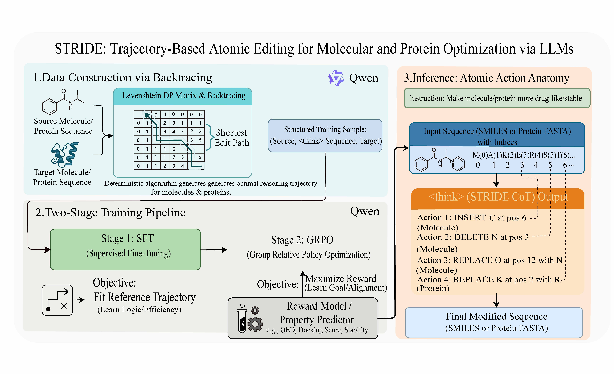

# Post-Training-LLMs-to-Reason-and-Refine-Bio-Sequences

STRIDE is a reproducible post-training framework for discrete bio-sequence optimization with explicit edit trajectories. It supports GFP protein optimization and SMILES molecule optimization with a two-stage recipe: SFT (LLaMA-Factory) then RL (ms-swift; GRPO / GSPO / CISPO).



## Installation

Conda:

```bash
conda env create -f environment/conda.yml
conda activate stride-public
```

pip:

```bash
python -m venv .venv
source .venv/bin/activate
pip install -r requirements/train.txt
```

## Choose your path
- **Path A: Inference + scoring only** → see [Evaluation](#evaluation)
- **Path B: Train GFP end-to-end (SFT → RL → Eval)** → see [Protein pipeline (GFP)](#protein-pipeline-gfp)
- **Path C: Train Molecule end-to-end (SFT → RL → Eval)** → see [Molecule pipeline (SMILES)](#molecule-pipeline-smiles)
- **Path D: Customize rewards / add tasks** → see [Customize (rewards / tasks)](#customize-rewards--tasks)


## Protein pipeline (GFP)

### Data

Source dataset: [SaProtHub/Dataset-Fluorescence-TAPE](https://huggingface.co/datasets/SaProtHub/Dataset-Fluorescence-TAPE)

#### Download (recommended)

```bash
# Requires: pip install -r requirements/train.txt  (installs huggingface_hub -> `hf`)
hf download SaProtHub/Dataset-Fluorescence-TAPE \
  --repo-type dataset \
  --local-dir data/raw/gfp_tape
```

Set `--input-arrow` to the downloaded `*.arrow` file(s), for example:
- `data/raw/gfp_tape/dataset-fluorescence-tape-train.arrow`

### Preprocess (Arrow → JSONL → ShareGPT → ms-swift)

1) Build delta-label dataset from a TAPE arrow file:

```bash
python scripts/data/prepare_gfp_delta.py \
  --input-arrow data/raw/gfp_tape/dataset-fluorescence-tape-train.arrow \
  --output-jsonl data/gfp/fluorescence_delta_dataset.jsonl
```

2) Convert to instruction data (ShareGPT):

```bash
python scripts/data/build_gfp_sharegpt.py \
  --input-jsonl data/gfp/fluorescence_delta_dataset.jsonl \
  --output-dir data/gfp/sharegpt \
  --format sharegpt
```

3) Convert ShareGPT to ms-swift format for RL:

```bash
python scripts/data/convert_sharegpt_to_swift.py \
  --input data/gfp/sharegpt/gfp_optimization_sharegpt_train.jsonl \
  --output-dir data/gfp/swift \
  --train-name train.jsonl \
  --valid-name valid.jsonl \
  --val-ratio 0.1 \
  --ability biology
```

### SFT (LLaMA-Factory)

```bash
bash scripts/train/run_sft_protein.sh
```

Common path overrides via env vars:
- `MODEL_NAME_OR_PATH`
- `DATASET_DIR`
- `OUTPUT_DIR`
- `CONFIG_PATH`

### RL (ms-swift via `GRPO/train_grpo.py`)

```bash
bash scripts/train/run_rl_gfp.sh
```

Hydra override example:

```bash
bash scripts/train/run_rl_gfp.sh swift.attn_impl=eager
```

## Molecule pipeline (SMILES)

### Data

Train/validation dataset: [nfsrulesFR/mega-moledit-522K](https://huggingface.co/datasets/nfsrulesFR/mega-moledit-522K)

Test reference set: [blazerye/MolOpt-Instructions `test_500.txt`](https://huggingface.co/datasets/blazerye/MolOpt-Instructions/blob/main/test_500.txt)

#### Download (recommended)

```bash
hf download nfsrulesFR/mega-moledit-522K \
  --repo-type dataset \
  --local-dir data/raw/mol_edit
```

Prepare your molecule table as parquet with input/output SMILES columns, then use [scripts/data/build_mol_edit_trajectory.py](scripts/data/build_mol_edit_trajectory.py) with `--input-col` and `--output-col`.

### Preprocess (Parquet → edit trajectory → ShareGPT → ms-swift)

1) Build edit trajectory parquet from paired SMILES parquet:

```bash
python scripts/data/build_mol_edit_trajectory.py \
  --input /path/to/train.parquet \
  --output /path/to/train.edit_traj.parquet \
  --traj-col edit_traj
```

2) Convert trajectory parquet to ShareGPT:

```bash
python scripts/data/build_mol_sharegpt.py \
  --input-dir /path/to/mol_parquet_dir \
  --output-dir data/mol_edit/sharegpt
```

3) Convert ShareGPT to ms-swift format for RL:

```bash
python scripts/data/convert_sharegpt_to_swift.py \
  --input data/mol_edit/sharegpt/train_sharegpt_edit_traj.jsonl \
  --output-dir data/mol_edit/swift \
  --train-name train.jsonl \
  --valid-name valid.jsonl \
  --val-ratio 0.1 \
  --ability chemistry
```

### SFT (LLaMA-Factory)

```bash
bash scripts/train/run_sft_molecule.sh
```

### RL (ms-swift via `GRPO/train_grpo.py`)

GRPO:

```bash
bash scripts/train/run_rl_molecule.sh
```

GSPO example:

```bash
bash scripts/train/run_rl_molecule.sh \
  algorithm.kl_ctrl.kl_coef=0.0 \
  algorithm.grpo.epsilon=3e-4 \
  +algorithm.grpo.epsilon_high=4e-4 \
  +algorithm.grpo.steps_per_generation=4 \
  +algorithm.grpo.importance_sampling_level=sequence
```

CISPO example:

```bash
bash scripts/train/run_rl_molecule.sh \
  +algorithm.grpo.loss_type=cispo \
  +algorithm.grpo.epsilon_high=5.0
```

## Evaluation

### Protein generation with vLLM

Sample protein candidates from a base model or an SFT/RL adapter.

```bash
python scripts/eval/infer_protein_vllm.py \
  --model Qwen/Qwen3-14B \
  --adapter /path/to/sft_or_rl_adapter \
  --output outputs/eval/protein_samples.json
```

### Molecule generation with vLLM

Sample optimized molecules from a base model or an SFT/RL adapter.

```bash
python scripts/eval/infer_molecule_vllm.py \
  --model Qwen/Qwen3-14B \
  --adapter /path/to/sft_or_rl_adapter \
  --input-smiles /path/to/test_smiles.txt \
  --output outputs/eval/molecule_samples.json
```

### Fluorescence scoring (protein)

Score generated protein sequences with the fluorescence regressor.

```bash
python scripts/eval/score_fluorescence.py \
  --input outputs/eval/protein_samples.json \
  --input-format json \
  --seq-field parsed_protein \
  --output outputs/eval/protein_samples_scored.json
```

## Customize (rewards / tasks)

- Reward plugins: `GRPO/gfp_plugin.py` + `GRPO/gfp_reward.py`, and `GRPO/chem_plugin.py` + `GRPO/chem_reward.py`.
- Config reward selection:
  - `configs/rl/gfp_grpo.yaml`: `swift.external_plugin: GRPO/gfp_plugin.py`, `swift.reward_func: gfp_reward`
  - `configs/rl/chem_grpo.yaml`: `swift.external_plugin: GRPO/chem_plugin.py`, `swift.reward_func: chem_reward`

Add a new reward:
1) Create `GRPO/<new_reward>.py` with the `compute_*` implementation.
2) Create `GRPO/<new_plugin>.py` that registers `orms["<name>"] = <YourORMClass>`.
3) Point your RL config to it by setting `swift.external_plugin` and `swift.reward_func`.
4) Run with overrides, for example:

```bash
bash scripts/train/run_rl_gfp.sh \
  swift.reward_func=<name> \
  swift.external_plugin=GRPO/<new_plugin>.py
```

## Expected outputs

- SFT adapters:
  - Protein: `outputs/gfp/sft/` (e.g., `adapter_model.safetensors`, `adapter_config.json`, `checkpoint-*`)
  - Molecule: `outputs/mol_edit/sft/`
- RL adapters / checkpoints:
  - Protein: `outputs/gfp/grpo/`
  - Molecule: `outputs/mol_edit/grpo/`
- Evaluation artifacts:
  - `outputs/eval/protein_samples.json`
  - `outputs/eval/protein_samples_scored.json`
  - `outputs/eval/molecule_samples.json`

## Repository layout

- [scripts/data/](scripts/data/): data preprocessing and format conversion
- `scripts/train/`: generic training launchers
- `scripts/eval/`: inference and scoring CLIs
- `scripts/slurm/`: optional scheduler templates
- `configs/sft/`: LLaMA-Factory SFT configs
- `configs/rl/`: RL configs for `GRPO/train_grpo.py`
- `configs/deepspeed/`: DeepSpeed configs
- `GRPO/`: reward plugins and RL command builder for ms-swift
- `baseline/edit_flows/`: optional Edit Flows baseline
- [data_example/](data_example/): tiny example data

<details>
<summary>Reference: scripts and configs</summary>

### Key scripts and their roles

#### Data preparation ([scripts/data/](scripts/data/))

- [scripts/data/prepare_gfp_delta.py](scripts/data/prepare_gfp_delta.py): convert TAPE Arrow GFP data to delta-label JSONL relative to WT.
- [scripts/data/build_gfp_sharegpt.py](scripts/data/build_gfp_sharegpt.py): convert GFP delta JSONL to instruction-tuning data (ShareGPT or Alpaca).
- [scripts/data/build_mol_edit_trajectory.py](scripts/data/build_mol_edit_trajectory.py): build edit-trajectory columns from paired input/output SMILES parquet data.
- [scripts/data/build_mol_sharegpt.py](scripts/data/build_mol_sharegpt.py): convert molecule trajectory parquet files into ShareGPT train/valid JSONL.
- [scripts/data/convert_sharegpt_to_swift.py](scripts/data/convert_sharegpt_to_swift.py): convert ShareGPT JSON/JSONL into ms-swift RL JSONL format.
- [scripts/data/augment_gfp_random_edit.py](scripts/data/augment_gfp_random_edit.py): generate optional synthetic random GFP edit records for auxiliary experiments.

#### Training launchers (`scripts/train/`)

- `scripts/train/run_sft_protein.sh`: launch protein SFT with default LLaMA-Factory config wiring.
- `scripts/train/run_sft_molecule.sh`: launch molecule SFT with default LLaMA-Factory config wiring.
- `scripts/train/run_rl_gfp.sh`: launch GFP RL training (GRPO-family) through `GRPO/train_grpo.py`.
- `scripts/train/run_rl_molecule.sh`: launch molecule RL training (GRPO/GSPO/CISPO variants) through `GRPO/train_grpo.py`.

#### RL backend (`GRPO/`)

- `GRPO/train_grpo.py`: Hydra entrypoint that resolves config paths and dispatches `swift rlhf` commands.
- `GRPO/gfp_plugin.py` + `GRPO/gfp_reward.py`: register and compute GFP reward functions.
- `GRPO/chem_plugin.py` + `GRPO/chem_reward.py`: register and compute molecule reward functions.

#### Evaluation (`scripts/eval/`)

- `scripts/eval/infer_protein_vllm.py`: run vLLM generation for protein variants from base/adapted models.
- `scripts/eval/infer_molecule_vllm.py`: run vLLM generation for molecule editing tasks.
- `scripts/eval/score_fluorescence.py`: score protein outputs with the SaProt fluorescence regressor.

</details>

## Edit Flows baseline

Independent from the STRIDE SFT + RL training path.

Training:

```bash
python baseline/edit_flows/train.py --help
```

Sampling:

```bash
python baseline/edit_flows/sample.py --help
```


## License

See `LICENSE`.
